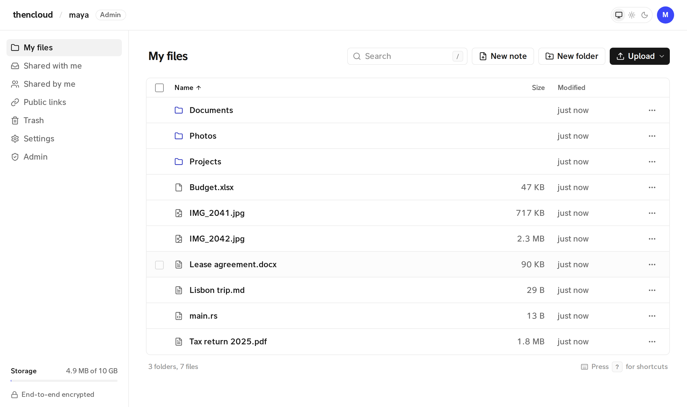

<p align="center">
  
</p>

<h1 align="center">thencloud</h1>

<p align="center">
  An open-source, <b>end-to-end encrypted</b> alternative to Nextcloud.
</p>

<p align="center">
  <a href="https://github.com/0x00ACAB/thencloud/actions/workflows/ci.yml"></a>
  <a href="https://github.com/0x00ACAB/thencloud/actions/workflows/codeql.yml"></a>
  <a href="LICENSE"></a>
  <a href="https://github.com/0x00ACAB/thencloud/milestones"></a>
  
  
</p>

<p align="center">
  <a href="#quick-start">Quick start</a> ·
  <a href="#how-the-encryption-works">How the encryption works</a> ·
  <a href="#threat-model">Threat model</a> ·
  <a href="MILESTONES.md">Roadmap</a> ·
  <a href="CONTRIBUTING.md">Contributing</a>
</p>

Files, folder names and keys are encrypted and decrypted **in your browser**. The server stores ciphertext and wrapped keys. It never receives your password, your keys, your file names or your file contents.

<picture>
  <source media="(prefers-color-scheme: dark)" srcset=".github/assets/screenshot-dark.png">
  
</picture>

> **Status:** 1.0, in use. A complete file cloud: accounts, folders, versions, sharing and public links, with a web app, desktop and Android apps and a command line. It hasn't had an independent security audit yet. See [CHANGELOG.md](CHANGELOG.md) and [MILESTONES.md](MILESTONES.md).

## Features

- **Files:** folders, drag-and-drop and folder uploads, resumable 4 MiB chunks, zip downloads, versions, trash, quotas.
- **Sharing:** with other users (read or write) after a fingerprint check, or by public link with the key after `#`, an optional password and expiry.
- **Previews and editing:** images, video, audio, PDF, code with highlighting, and a Markdown editor, all decrypted in the browser.
- **Converting:** images, video and audio to other formats in the browser with canvas encoders and ffmpeg.wasm.
- **Music:** pick a folder and play it as a library of albums, with a queue, shuffle, cover art and media keys. Tracks are decrypted as they stream; tags are read in the browser.
- **Accounts:** two-step sign-in with an authenticator app or passkeys (which can also sign in without the password), an optional recovery key, session and device list, and an admin view that counts things but can't read them.
- **Command line and Linux drive:** a native client that signs in with an app password, syncs folders, makes encrypted backups you can restore to any server, and mounts your files as a drive (FUSE) for Dolphin, Nautilus or the shell. See [crates/thencloud-cli](crates/thencloud-cli/README.md).
- **Desktop and Android apps:** the web client bundled into a Tauri app for Linux, Windows and Android, so its code comes with the app instead of from the server. See [crates/thencloud-app](crates/thencloud-app/README.md).
- **Self-hosted and small:** one Rust binary, SQLite and a folder of encrypted blobs (or an S3-compatible bucket). Nothing loads from a CDN.

## Quick start

Requirements:
- A [rustup](https://rustup.rs) toolchain with the `wasm32-unknown-unknown` target. `build.sh` adds the target if it's missing.
- `wasm-pack`, installed with `cargo install wasm-pack`.
- Node.js with npm, for building the web client.

```sh
./build.sh --release
./target/release/thencloud-server --bind 127.0.0.1:8080
# open http://127.0.0.1:8080
```

The first account to register becomes the admin. So that nobody else can claim a new server first, making it needs the **setup code** the server prints in its log on first start (and keeps in `setup-code` in the data directory until it's used); `--admin-username` also fixes that account's name. With Docker: `docker compose logs thencloud | grep "setup code"`.

### With Docker

```sh
docker build -t thencloud .
docker run -p 127.0.0.1:8080:8080 -v thencloud-data:/data thencloud
```

For a server on the internet, `deploy/compose.yaml` runs thencloud behind [Caddy](https://caddyserver.com), which gets a certificate for your domain:

```sh
THENCLOUD_DOMAIN=cloud.example.com docker compose -f deploy/compose.yaml up -d
```

The image builds the web client the same way releases do, so `thencloud verify-web` can check it against a signed release: build it from the release's tag with `--build-arg THENCLOUD_VERSION=<tag>` (the version is part of every page). Each release also has server and CLI binaries for Linux (x86_64, arm64) and macOS (arm64); the server needs the release's web client unpacked next to it (`--web-dir`).

### As a Tor onion service

Run thencloud behind a Tor onion service and the server never learns its users' IP addresses (`deploy/onion/torrc` has the lines to add):

```sh
thencloud-server --bind 127.0.0.1:8080 --limit-by-address false
```

- Every visitor reaches the server from Tor's own address, so `--limit-by-address false` limits sign-in attempts per account (and link passwords per link) instead. Otherwise one person's wrong guesses would lock everyone out.
- Onion addresses are plain `http://`, and that's fine: Tor encrypts the connection end to end and the address itself authenticates the server. Tor Browser treats onion pages as secure contexts, which the web client needs. The server accepts passkeys made on an onion address, if the browser offers them there. Tor Browser forgets site data when it closes, so "Keep me signed in" only lasts until then.
- Keep the server's port bound to 127.0.0.1 only; if it's reachable directly as well, that way in shows addresses again.
- The CLI knows nothing about Tor; run it under `torsocks`.

### Server options

Every flag can also be set as an environment variable.

| Flag | Env | Default |
|---|---|---|
| `--bind` | `THENCLOUD_BIND` | `127.0.0.1:8080` |
| `--data-dir` | `THENCLOUD_DATA_DIR` | `./data` (SQLite DB + encrypted blobs, unless S3 is configured) |
| `--s3-endpoint` | `THENCLOUD_S3_ENDPOINT` | unset. Endpoint of an S3-compatible blob store (e.g. `https://s3.amazonaws.com`, or `http://127.0.0.1:9000` for MinIO). Set it with `--s3-bucket`, `--s3-access-key` and `--s3-secret-key` to keep the encrypted blobs in a bucket instead of the data directory; the database always stays local. Requests are path-style |
| `--s3-region` | `THENCLOUD_S3_REGION` | `us-east-1` (most S3-compatible servers accept anything) |
| `--s3-bucket` | `THENCLOUD_S3_BUCKET` | unset |
| `--s3-access-key` | `THENCLOUD_S3_ACCESS_KEY` | unset |
| `--s3-secret-key` | `THENCLOUD_S3_SECRET_KEY` | unset |
| `--s3-prefix` | `THENCLOUD_S3_PREFIX` | empty (key prefix inside the bucket, e.g. `thencloud/`) |
| `--s3-mirror` | `THENCLOUD_S3_MIRROR` | `false`. With S3 configured, keep every blob in the data directory too: written to both, read from the disk (free), and from the bucket only when the disk doesn't have it, which puts it back on the disk |
| `--s3-snapshot-hours` | `THENCLOUD_S3_SNAPSHOT_HOURS` | `24`. With S3 configured, put a snapshot of the database in the bucket (under `db/`) this often, so the server can be rebuilt from the bucket alone. `0` turns it off |
| `--s3-snapshots-kept` | `THENCLOUD_S3_SNAPSHOTS_KEPT` | `7` (older database snapshots are deleted) |
| `--web-dir` | `THENCLOUD_WEB_DIR` | `./web/dist` (the built web client) |
| `--admin-username` | `THENCLOUD_ADMIN_USERNAME` | unset. The name the first account (the admin) must have; it also needs the setup code from the log |
| `--allow-registration` | `THENCLOUD_ALLOW_REGISTRATION` | `true` (the first user can always register, with the setup code, and becomes an admin). Admins can switch between open, invite-only and closed at runtime in the Admin view, which overrides this |
| `--default-quota` | `THENCLOUD_DEFAULT_QUOTA` | 10 GiB |
| `--session-days` | `THENCLOUD_SESSION_DAYS` | `30` |
| `--max-versions` | `THENCLOUD_MAX_VERSIONS` | `10` (versions kept per file, including the current one) |
| `--version-thinning` | `THENCLOUD_VERSION_THINNING` | `true` (thin out old versions by age: all from the last hour, then one per hour for a day, one per day for 30 days, one per week after that) |
| `--trash-days` | `THENCLOUD_TRASH_DAYS` | `30` (days before trashed items are purged) |
| `--upload-ttl-hours` | `THENCLOUD_UPLOAD_TTL_HOURS` | `24` |
| `--yt-dlp` | `THENCLOUD_YT_DLP` | `yt-dlp` (for the optional video downloader; it stays off until an admin enables it) |
| `--ffmpeg` | `THENCLOUD_FFMPEG` | `ffmpeg` (lets the downloader merge separate video and audio, which most YouTube videos need) |
| `--downloader-max-bytes` | `THENCLOUD_DOWNLOADER_MAX_BYTES` | `2147483648` (2 GiB per video) |
| `--trust-proxy` | `THENCLOUD_TRUST_PROXY` | `false`. Behind a reverse proxy, take the client's address from `X-Forwarded-For` (used only to rate-limit sign-in attempts, never stored). Only turn it on when clients can't reach the server directly |
| `--metrics-token` | `THENCLOUD_METRICS_TOKEN` | unset. When set, `GET /api/metrics` serves Prometheus metrics (the counts in the admin view) to requests with `Authorization: Bearer <token>` |

`GET /api/health` answers `200 ok` while the database and data directory are available, and `503` otherwise. It needs no sign-in.

### Backup and restore

```sh
thencloud-server --data-dir ./data backup /backups/thencloud-2026-09-28
```

This writes a consistent snapshot of the database and every blob it refers to into a new directory. It's safe while the server is running. On the same filesystem the blobs are hard links, which is instant and takes no extra space; elsewhere they're copied. If a file is deleted while the backup runs, its missing pieces are listed and the command exits with status 2. Like the server, a backup holds only ciphertext and wrapped keys.

The destination can also be a bucket: `backup s3://my-backups/thencloud/` (using the configured `--s3-endpoint` and credentials), from either a local or an S3 blob store.

With S3 configured, the bucket is a backup in its own right: the database goes there as a snapshot once a day (`--s3-snapshot-hours`), next to the blobs, and with `--s3-mirror` the blobs are on the local disk as well. If the disk is lost, `thencloud-server --data-dir <new dir> <the same S3 options> restore-snapshot` puts the newest snapshot back, and the server starts as it was then. Files uploaded after that snapshot aren't in its database, and `check` lists their blobs as not referred to. Snapshots hold what the server already has, wrapped keys and ciphertext, never a key or a name.

To restore, stop the server, copy the backup to where the data should live, and start the server with `--data-dir` pointing at it. Then run `thencloud-server --data-dir <dir> check`: it checks that every blob the database expects is there with the right size, and lists any that nothing refers to. To restore an S3 backup, put its `thencloud.db` in a data directory and run with `--s3-prefix` pointing at the backup's `blobs/` prefix. To check that files also decrypt, use Settings > Check your files in the web client.

 (for example, behind a reverse proxy). The crypto protects data at rest on the server, but the page and its WASM must reach the browser intact.

## Layout

```
crates/thencloud-crypto   All cryptography + shared JSON wire types (native & WASM)
crates/thencloud-wasm     wasm-bindgen bindings used by the web client
crates/thencloud-server   axum + SQLite server, local or S3 blob store
crates/thencloud-cli      command-line client and FUSE mount (`thencloud`)
crates/thencloud-app      Tauri app for Linux, Windows and Android (the web client, bundled)
web/                      browser client: Svelte 5 + Vite + Tailwind CSS
docs/format               the ciphertext formats and key derivations, with test vectors
```

## How the encryption works

```
password ──Argon2id──► root ──HKDF──┬─► auth_key  → server (stored only as Argon2id(auth_key))
                                    └─► kek       (never leaves the client)
kek        ──wraps──► master key
recovery key (optional, 256-bit) ──HKDF──┬─► recovery auth → server (stored only as Argon2id)
                                         └─► recovery kek ──wraps──► master key
passkey PRF output (optional) ──HKDF──► passkey kek ──wraps──► master key
master key ──wraps──► X25519 private key, ML-KEM-768 seed, root folder key
folder key ──wraps──► child node keys
node key   ──seals──► metadata {name, mime, size, mtime}
file key   ──wraps──► per-version content key ──seals──► 4 MiB chunks
```

Every byte of this is written down in [`docs/format`](docs/format/README.md), with test vectors that the Rust crate and the WASM build are checked against, so other clients can be written from the spec.

Primitives:
- **AEAD:** XChaCha20-Poly1305.
- **KDF:** Argon2id (64 MiB, t=3) and HKDF-SHA256.
- **Sharing:** hybrid X25519 + ML-KEM-768 sealed boxes (plain X25519 to accounts that don't have an ML-KEM key yet).

Every ciphertext carries associated data that binds it to its context:
- Node keys and metadata are bound to the node id.
- Content keys are bound to the node id and version id.
- Chunks are bound to the version id, chunk index and an is-last flag.

As a result, a malicious server cannot swap files, move ciphertexts between nodes, reorder or truncate chunks, or serve an old version's chunks under a new one. Decryption fails if it tries.

**Sharing with a user:** the owner fetches the recipient's public key, checks its fingerprint (shown in both users' UIs), and seals the folder or file key to it. The recipient opens the sealed key with their private key and can then unwrap the whole subtree.

**Post-quantum sealing:** every account has an ML-KEM-768 keypair (FIPS 203) next to its X25519 one; the 64-byte seed is wrapped under the master key, and accounts made before this get one on their next sign-in (the server never replaces one once set). A key sealed to such a user runs both key exchanges and feeds both shared secrets to HKDF, with every public value in the salt, so a recording of the share stays closed unless both X25519 and ML-KEM are broken. The fingerprint covers the X25519 key and the SHA-256 of the ML-KEM key. A contact verified before they had an ML-KEM key stays verified while the X25519 half matches, and the new half is pinned the first time it's seen. File drop links carry the same 64 bytes after `#`; the page takes the ML-KEM key from the server and refuses it unless its hash matches.

**Two-step sign-in:** with an authenticator app (TOTP) or any passkey set up, a correct password gets a short-lived ticket instead of a session, and the wrapped master key is only handed out once a code or a passkey assertion checks out. Neither holds a key: the TOTP secret is a verifier, and codes are single-use. App passwords and the recovery key skip this step; they are 256-bit secrets of their own, and the recovery key is the way back in when the phone and passkeys are gone.

**Passkeys** (WebAuthn) work as that second step, and when the authenticator supports the PRF extension they can also sign in on their own. The browser asks the passkey for its PRF output for a fixed input, derives a KEK from it with HKDF, and wraps a copy of the master key under it, bound to the credential id. Signing in with the passkey alone needs user verification (PIN or biometric); the server checks the signature (ES256, EdDSA or RS256) against a one-time challenge and only then returns the wrapped copy, which it can't unwrap itself. Each passkey is bound to the host it was made on.

**Recovery key (optional):** made in the browser and shown once as 11 groups of 5 characters (Crockford base32 with a checksum, so typos are caught). The server stores the master key wrapped under its KEK and a hash of its auth part, so it can check the key but never use it. With the key and a username, "Forgot your password?" unwraps the master key locally and sets a new password; every session is signed out. Setting, replacing or removing the key needs the current password.

**App passwords** are for sync clients and other devices. Each is 32 random bytes made in the browser and shown once, in the same format as the recovery key. HKDF splits it into an auth key (the server keeps its SHA-256, which is enough for a random 256-bit secret) and a KEK that wraps its own copy of the master key, bound to the app password's id. A client signs in with `POST /api/auth/app-login` and the auth key alone, then unwraps the master key locally. App passwords can be read only, need the account password to create, survive password changes, and revoking one signs out every session it started.

**Profile pictures** are encrypted in the browser under a random avatar key. Your own copy of that key is encrypted under your master key, and it is sealed to each person you share with, or who shares with you, so only they can see the picture. Each new picture gets a new key, sealed only to verified contacts you share with at the time, and the server stops handing it to someone once you no longer share anything. Removing the picture also deletes every sealed copy. An optional **display name** (any script, for people whose name doesn't fit in a username) is encrypted under the same key and goes to the same people, padded so its length doesn't show. It's always shown with the username after it, since anyone can choose any display name.

**Public links** look like `https://host/s/<token>#<key>`. Browsers never send the part after `#` in any HTTP request, so the server only ever sees `<token>`. The share page reads the key from `location.hash` and decrypts locally. Other defences:
- `Referrer-Policy: no-referrer` and a strict same-origin CSP keep the URL from leaking to third parties.
- An optional password is part of the key. The link then carries a random secret after `#` instead of the key, and the key is wrapped under the secret and the password together (Argon2id in the browser). Visitors prove the password with a key derived from it, so the server never sees the password, and a server that skipped the check would still hand out nothing anyone can open without it.

### Threat model

**The server can see:**
- Usernames and public keys.
- The shape of the folder tree: which node is inside which, and file vs folder.
- Whether two items in the same folder have the same name (each carries a keyed hash of its lower-cased name under the folder key, so duplicates can be refused), but not what the names are.
- Ciphertext sizes and chunk counts. File contents are padded (every file under 16 KiB to 16 KiB, larger ones with Padmé, at most about 12% extra) and metadata to 128-byte steps, so these give only rough sizes.
- Timestamps.
- Who shares with whom, with what permission, and which nodes have public links.
- IP addresses and access patterns.

**The server cannot see:**
- Passwords, master keys or private keys.
- File and folder keys.
- File and folder names, MIME types, plaintext sizes and modification times.
- File contents.

**No analytics, ever.** thencloud has no telemetry, tracking or crash reporting, and it never will. The web client talks only to your server: its Content Security Policy allows nothing else (no CDNs, fonts or third-party scripts), a server test fails if that policy ever lets another host in, and the browser tests fail if any request goes elsewhere. The server makes no connections of its own, except to an S3 bucket you configure and, if an admin turns the video downloader on, to the sites people download from.

**Optional bot check.** A server can ask for a Cloudflare Turnstile check before sign-in, and before registration while it's open to everyone (`--turnstile-site-key` and `--turnstile-secret`, off by default). It's the one exception above, so it's kept to a page of its own, `/auth`: only that page's CSP lets in Cloudflare's script, and it has no password field and loads no keys. It hands the app page a one-time token and sends you back. The server checks the token with Cloudflare, sending the secret and the token and nothing else (not your username or address), and takes each token once. The app page's CSP doesn't change, and a sign-in kept on the browser is dropped after a visit to `/auth`, since Cloudflare's script shared the site's storage there. The first account, invited people, recovery keys, passkeys and app passwords skip the check; the desktop and Android app can't show it yet.

**Known limitations**, most of them tracked in [MILESTONES.md](MILESTONES.md):
- **The web client is served by the server.** A malicious or compromised server could serve modified JavaScript. This is inherent to every browser-based E2EE app. The native client (`crates/thencloud-cli`) and the apps (`crates/thencloud-app`, which bundle the web client) avoid it, and releases make it checkable: the web client builds reproducibly (`scripts/release-web.sh`, byte for byte the same on any machine with the pinned toolchain), each release publishes a minisign-signed manifest of every file's SHA-256, and `thencloud verify-web https://your.server --manifest thencloud-web-<version>.json` fetches every file in every encoding the server offers and compares. That shows what the server sends to anyone who asks; a server that singles out one browser needs a check inside the browser to catch. As a tripwire for that, the web client's service worker remembers the SHA-256 of each app page and of each code file (which have content-hashed names, so a name must always hold the same bytes). When a page changes, it shows a notice before opening it, with the old and new version and how to check them; a code file that changes under the same name is refused. Settings shows the running version and the `verify-web` command for it. It's not proof: the browser fetches the service worker itself from the server, so a server that replaces it first can get past it.
- **Public keys are trust-on-first-use.** Compare fingerprints out of band the first time you share with someone, or a malicious server could substitute its own key. After that the key is pinned in your verified contacts (encrypted under your master key and bound to your account), and a different key for that person blocks sharing until you check again.
- **Revoking a share** stops the server from serving the data, but it does not re-key. A former recipient who kept the key could decrypt ciphertext they get from elsewhere.
- **File drop links** (upload-only) carry your public key instead of a folder key. Visitors seal each file's key to it, and your client wraps it under the folder key the next time you browse, but only for folders that have a file drop link. When a dropped file is taken in, it gets a fresh key, so the key the visitor chose can't read later versions. Files dropped through a link that has since gone are never taken in automatically; they wait for you to keep or delete them. Anyone with the link, the server included, can add files to that folder, but nobody but you can read them. A drop can't make the server delete your old versions to make room.
- **Anyone who has a full public link** (including the `#` part, for example from chat history) can decrypt what it points to.
- **The video downloader is the one feature where the server sees content.** It's off unless an admin turns it on. When used, the server runs yt-dlp (and ffmpeg to remux) for the link you give it and streams the video to your browser, which encrypts and uploads it like any file. So the server sees the link and the video while it passes through. Nothing is written to its disk or logged, only yt-dlp's site extractors run, and links to private or local addresses are refused.
- **"Keep me signed in on this browser" is a trade-off you opt into.** Normally keys live only in memory and a reload asks for your password. With the box ticked, the session token and master key are saved in the browser's IndexedDB, encrypted with a key the browser won't let any script export. That protects them at rest about as well as your browser profile and disk encryption do; anyone who can use that computer account can open your files. They're deleted when you sign out, choose "Stop keeping signed in", or the session ends on the server.
- **There is no password reset by the server.** A forgotten password means the data is lost, unless you created a recovery key. Anyone with your recovery key and username can take over the account, so keep it as private as the password.
- **Previews render files other people shared with you** inside the app, where your keys live. Decrypted bytes are always re-typed to a fixed, known-safe type (never the stored MIME type), Markdown goes through DOMPurify with scripts removed and images never loaded (in the preview and the editor, so a relative image path can't make the browser request a plaintext name from the server), and PDFs are drawn to canvas by pdf.js without running any PDF JavaScript. The CSP is the second line of defence.

## Development

```sh
cargo test --workspace          # crypto unit tests + end-to-end server tests
cd web && npm run dev           # hot-reloading client; proxies /api to a server on :8080 (or $THENCLOUD_API)
cd web && npm run check         # svelte-check
```

`crates/thencloud-server/tests/e2e.rs` drives a real server in-process with a native client built on `thencloud-crypto`. It covers register, upload, move, share, public link, revoke, version history and the trash. It then scans the SQLite database and blob store to check that no plaintext names, contents, passwords or keys were stored. `crates/thencloud-cli/tests/cli.rs` does the same for the command-line client and the FUSE mount over real HTTP (the mount tests need `/dev/fuse` and `fusermount3`, and are skipped without them).

CI runs `cargo fmt`, `cargo clippy`, the tests, `svelte-check` and a full web build on every pull request, and CodeQL scans the Rust, JavaScript and workflow code. On a release tag, the web client is built with `scripts/release-web.sh` on two different runner images, the two must match byte for byte, every release file is signed with Sigstore (keyless, as the release workflow at that tag, logged in Rekor), and they go into a draft release; a maintainer rebuilds it, adds a minisign signature of the manifest and publishes. `thencloud verify-web` checks both. Dependabot keeps Cargo, npm and Actions dependencies current. See [CONTRIBUTING.md](CONTRIBUTING.md) before sending a pull request.

## Roadmap

[MILESTONES.md](MILESTONES.md) is the roadmap. Each section is mirrored as a [GitHub milestone]({R}/milestones) and each open item as an issue labelled [`roadmap`]({R}/issues?q=label%3Aroadmap), which a workflow keeps in sync.

## Security

Found a way for the server to learn something it shouldn't? Please report it privately; see [SECURITY.md](SECURITY.md).

## License

AGPL-3.0-or-later. See [LICENSE](LICENSE).

The web client bundles the fonts Console Sans (OFL; originals in `assets/fonts/`) and [Geist](https://vercel.com/font) (OFL), [Lucide](https://lucide.dev) icons (ISC), [highlight.js](https://highlightjs.org) (BSD-3-Clause), [marked](https://marked.js.org) (MIT), [DOMPurify](https://github.com/cure53/DOMPurify) (Apache-2.0 or MPL-2.0), [Milkdown](https://milkdown.dev) (MIT), [fflate](https://github.com/101arrowz/fflate) (MIT), [ffmpeg.wasm](https://github.com/ffmpegwasm/ffmpeg.wasm) (the `@ffmpeg/ffmpeg` wrapper is MIT; the `@ffmpeg/core` WASM build of FFmpeg is GPL-2.0-or-later, source at that link), [pdf.js](https://mozilla.github.io/pdf.js/) (Apache-2.0), and the file icon packs [Material Icon Theme](https://github.com/material-extensions/vscode-material-icon-theme) (MIT), [Symbols](https://github.com/miguelsolorio/vscode-symbols) (MIT) and [file-icon-vectors](https://github.com/dmhendricks/file-icon-vectors) (MIT). All of it is served from your own server; nothing loads from a CDN.
